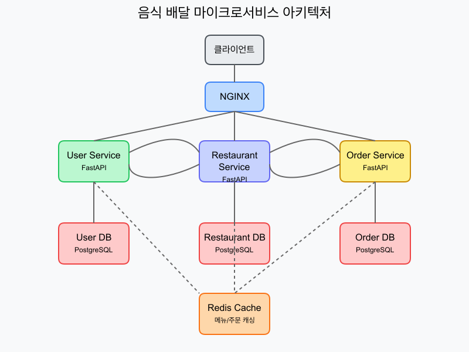

# 음식 배달 마이크로서비스

이 프로젝트는 음식 배달 서비스를 위한 마이크로서비스 아키텍처 기반 애플리케이션입니다. 
성능 테스트와 장애 주입을 위한 기능들이 포함되어 있습니다.

## 아키텍처



이 시스템은 다음과 같은 마이크로서비스로 구성되어 있습니다:

1. **User Service**: 사용자 인증 및 관리
2. **Restaurant Service**: 음식점, 메뉴 관리 및 재고 관리
3. **Order Service**: 주문 생성 및 관리

각 서비스는 독립적인 데이터베이스를 가지고 있으며, Redis를 사용한 캐싱이 구현되어 있습니다.

## 기술 스택

- **백엔드**: FastAPI (Python)
- **데이터베이스**: PostgreSQL
- **캐싱**: Redis
- **컨테이너화**: Docker, Docker Compose
- **로드 밸런싱**: NGINX
- **모니터링**: Prometheus, Loki, Tempo, Grafana
- **분산 추적**: OpenTelemetry, Tempo

## 시작하기

### 사전 요구사항

- Docker 및 Docker Compose가 설치되어 있어야 합니다.

### 사전 설정

시스템을 시작하기 전에 다음 필수 Docker 리소스를 생성해야 합니다:

```bash
# 로그 저장용 볼륨 생성
docker volume create sample-micro-app_microservices_logs

# 마이크로서비스와 모니터링 시스템 간 통신을 위한 네트워크 생성
docker network create monitoring
```

이 리소스들은 docker-compose.yml 파일에서 외부 리소스로 지정되어 있어 미리 생성해야 합니다:
- `sample-micro-app_microservices_logs`: 마이크로서비스의 로그를 저장하고 Promtail이 수집할 수 있도록 하는 공유 볼륨
- `monitoring`: 마이크로서비스와 모니터링 인프라(Prometheus, Loki, Tempo, Grafana 등) 간의 통신을 위한 공유 네트워크

### 실행 방법

다음 순서로 시스템을 시작하세요:

1. 먼저 모니터링 인프라 시작:
```bash
cd infra
docker-compose up -d
```

2. 그 다음 마이크로서비스 애플리케이션 시작:
```bash
cd ..  # 프로젝트 루트 디렉토리로 이동
docker-compose up -d
```

모든 서비스가 정상적으로 시작되면 다음 포트로 각 서비스에 접근할 수 있습니다:

- User Service: http://localhost:8001
- Restaurant Service: http://localhost:8002
- Order Service: http://localhost:8003
- API Gateway: http://localhost:80
- Grafana (모니터링): http://localhost:3000 (admin / password)
- Prometheus (메트릭): http://localhost:9090
- Tempo (분산 추적): http://localhost:3200

### API 문서 (Swagger UI)

각 서비스는 Swagger UI를 통해 상세한 API 문서를 제공합니다. 이 문서를 통해 각 API 엔드포인트의 기능, 파라미터, 응답 형식을 확인하고 직접 테스트해볼 수 있습니다.

- User Service: http://localhost:8001/docs
- Restaurant Service: http://localhost:8002/docs
- Order Service: http://localhost:8003/docs

#### Swagger UI 사용법

1. **API 엔드포인트 탐색**: 각 서비스의 API 엔드포인트가 기능별로 그룹화되어 있습니다.
2. **API 상세 정보 확인**: 각 엔드포인트를 클릭하면 상세 설명, 요청 파라미터, 응답 형식을 볼 수 있습니다.
3. **API 테스트**: "Try it out" 버튼을 클릭하여 직접 API를 테스트할 수 있습니다.
4. **요청 예시**: 각 API별로 요청 예시가 제공되어 어떤 형식으로 요청해야 하는지 파악할 수 있습니다.
5. **응답 예시**: 예상되는 응답 형식과 상태 코드가 자세히 문서화되어 있습니다.

#### 향상된 API 문서 기능

Swagger UI는 다음과 같은 향상된 기능을 제공합니다:

- **직관적인 아이콘**: 기능별 카테고리에 아이콘이 추가되어 시각적으로 구분이 쉽습니다.
- **요약 정보 강화**: API 이름 앞에 표시(👉)가 추가되어 API 목적을 한눈에 파악할 수 있습니다.
- **상세 설명 개선**: API를 마우스 오버하면 강조된 요약 설명과 함께 상세한 가이드를 확인할 수 있습니다.
- **API 그룹화**: 관련 API들이 논리적인 그룹으로 정리되어 있어 필요한 API를 쉽게 찾을 수 있습니다.

#### ReDoc 문서

더 깔끔한 형태의, 읽기 전용 API 문서가 필요하다면 ReDoc 문서도 제공됩니다:

- User Service: http://localhost:8001/redoc
- Restaurant Service: http://localhost:8002/redoc
- Order Service: http://localhost:8003/redoc

## API 엔드포인트

### User Service (8001 포트)

| 엔드포인트 | 메소드 | 기능 | 장애 주입용 파라미터 |
|------------|--------|------|----------------------|
| /signup | POST | 회원 가입 | - |
| /login | POST | JWT 토큰 발급 | - |
| /users/{id} | GET | 사용자 정보 조회 | - |
| /validate | POST | 주문 시 유효 사용자 확인 | ?delay=2000 (ms 단위 지연) |
| /chaos/delay | POST | 모든 API에 인위적 지연 설정 | { "delay_ms": 1500 } |
| /chaos/error | POST | 50% 확률로 500 에러 발생 | { "enable": true } |

### Restaurant Service (8002 포트)

| 엔드포인트 | 메소드 | 기능 | 캐싱/동시성 제어 |
|------------|--------|------|------------------|
| /menus | GET | 전체 메뉴 조회 | Redis 캐시(10초) |
| /menus/{id} | GET | 단일 메뉴 상세 조회 | Redis 캐시(30초) |
| /inventory/{menuId} | PUT | 재고 감소 (동시성 제어 적용) | Pessimistic Lock |
| /chaos/inventory_delay | POST | 재고 업데이트 지연 설정 | { "delay_ms": 3000 } |

### Order Service (8003 포트)

| 엔드포인트 | 메소드 | 기능 | 외부 호출 의존성 |
|------------|--------|------|------------------|
| /orders | POST | 주문 생성 | User Service → Restaurant Service → Redis |
| /orders/{id} | GET | 주문 상태 조회 | - |
| /orders/{id}/cancel | POST | 주문 취소 | Restaurant Service 재고 복구 |
| /chaos/payment_fail | POST | 결제 실패율 설정 | { "fail_percent": 30 } |

## 부하 테스트 시나리오

마이크로서비스 환경에서 시스템의 성능과 복원력을 테스트하기 위한 효과적인 시나리오들입니다.

### 1. 카오스 엔지니어링 테스트

결제 실패율을 조정하여 롤백 기능과 오류 처리 메커니즘을 테스트합니다:

```bash
# 30%의 확률로 결제가 실패하도록 설정
curl -X POST http://localhost:8003/chaos/payment_fail -H "Content-Type: application/json" -d '{"fail_percent": 30}'
```

이 설정 후 주문을 생성하면 30%의 확률로 결제가 실패하고 시스템이 자동으로 재고를 복구하며 주문 상태를 'FAILED'로 변경합니다. 이를 통해:
- 실패 처리의 정확성 검증
- 재고 자동 복구 메커니즘 테스트
- 트랜잭션 롤백의 안정성 확인

### 2. 동시 주문 부하 테스트

여러 사용자가 동시에 같은 메뉴에 주문할 때의 동시성 문제를 테스트합니다:

```bash
# JMeter 또는 다른 부하 테스트 도구를 이용해 동시에 여러 주문 생성
# POST /orders 엔드포인트에 다수의 동시 요청
```

이 테스트는:
- 동시성 제어 메커니즘의 효율성
- 재고 관리의 일관성
- 데이터베이스 락 전략의 성능
을 검증하는 데 유용합니다.

### 3. 취소-재주문 시나리오

주문 생성 후 취소하고 다시 주문하는 패턴을 반복하여 재고 관리의 일관성을 테스트합니다:

```bash
# 1. 주문 생성
curl -X POST http://localhost:8003/orders -H "Authorization: Bearer {토큰}" -H "Content-Type: application/json" -d '{
  "items": [{"menu_id": 1, "quantity": 2}],
  "address": "서울시 강남구 123-45",
  "phone": "010-1234-5678"
}'

# 2. 주문 ID 확인 후 취소
curl -X POST http://localhost:8003/orders/{order_id}/cancel

# 3. 동일한 메뉴로 다시 주문
```

이 시나리오는:
- 재고 복구 메커니즘의 정확성
- 취소-재주문 과정에서의 일관성
- 상태 변경의 신뢰성
을 검증합니다.

### 4. 캐싱 효과 테스트

Redis 캐싱이 어떻게 성능을 향상시키는지 검증합니다:

```bash
# 1. 특정 주문 조회 (캐시 미스, DB 조회)
time curl http://localhost:8003/orders/{order_id}

# 2. 동일한 주문 다시 조회 (캐시 히트)
time curl http://localhost:8003/orders/{order_id}

# 3. 5분 후 다시 조회 (캐시 만료, DB 조회)
```

응답 시간을 비교하여:
- 캐시 효율성 측정
- 캐시 만료 정책 검증
- 시스템 성능 향상 정도 확인

### 5. 마이크로서비스 간 통신 테스트

서비스 간 통신이 발생하는 전체 흐름을 테스트합니다:

```bash
# 1. 로그인하여 토큰 획득
curl -X POST http://localhost:8001/login -H "Content-Type: application/json" -d '{"username": "user", "password": "pass"}'

# 2. 획득한 토큰으로 주문 생성
curl -X POST http://localhost:8003/orders -H "Authorization: Bearer {토큰}" -H "Content-Type: application/json" -d '{
  "items": [{"menu_id": 1, "quantity": 2}],
  "address": "서울시 강남구 123-45",
  "phone": "010-1234-5678"
}'
```

이 테스트로:
- 서비스 간 인증 체계 검증
- 분산 트랜잭션의 일관성 확인
- 전체 시스템 통합의 견고성 테스트

### 6. 지연 주입 테스트

서비스에 인위적 지연을 추가하여 타임아웃 처리와 회복력을 테스트합니다:

```bash
# 사용자 서비스에 2초 지연 설정
curl -X POST http://localhost:8001/chaos/delay -H "Content-Type: application/json" -d '{"delay_ms": 2000}'

# 지연 설정 후 주문 생성 시도
```

이를 통해:
- 타임아웃 처리 메커니즘 검증
- 서비스 지연 시 사용자 경험 측정
- 시스템의 회복 탄력성 확인

## 부하 테스트 도구 권장

위 시나리오를 효과적으로 실행하기 위한 도구 권장사항:

1. **Apache JMeter**: 복잡한 시나리오와 동시 사용자 시뮬레이션에 적합
2. **Locust**: Python 기반으로 사용자 행동 패턴을 정의하기 쉬움
3. **k6**: 개발자 친화적인 JavaScript 기반 부하 테스트 도구
4. **Shell 스크립트**: 간단한 테스트를 위한 curl 명령 활용

## 테스트 시나리오 가이드

### 1. 기본 사용자 흐름

1. **회원 가입**: User Service의 `/signup` API를 사용해 계정 생성
2. **로그인**: `/login` API로 JWT 토큰 발급
3. **메뉴 목록 조회**: Restaurant Service의 `/menus` API로 메뉴 확인
4. **주문 생성**: Order Service의 `/orders` API로 주문 (토큰 필요)
5. **주문 상태 확인**: `/orders/{id}` API로 주문 상태 확인
6. **주문 취소**: 필요한 경우 `/orders/{id}/cancel` API로 주문 취소

### 2. 성능 테스트 시나리오

1. **캐싱 효과 측정**: 
   - Restaurant Service의 `/menus` API 반복 호출하여 첫 호출과 이후 호출의 응답 시간 비교
   - JMeter 등의 도구로 응답 시간 측정

2. **동시성 제어 테스트**:
   - 여러 클라이언트에서 동시에 특정 메뉴 주문
   - 재고가 정확히 감소하는지 확인

## 성능 테스트 및 장애 주입

이 시스템은 다양한 카오스 엔지니어링 기능을 제공합니다:

1. **인위적 지연 설정**: 각 서비스에서 특정 API 호출에 지연을 추가할 수 있습니다.
2. **에러 주입**: 일정 확률로 에러를 발생시켜 시스템 복원력을 테스트할 수 있습니다.
3. **결제 실패 시뮬레이션**: 주문 서비스에서 결제 실패율을 조정하여 롤백을 테스트할 수 있습니다.

### 성능 테스트 예제

```bash
# 1. User Service에 2초 지연 설정
curl -X POST http://localhost:8001/chaos/delay -H "Content-Type: application/json" -d '{"delay_ms": 2000}'

# 2. Restaurant Service의 재고 업데이트에 3초 지연 설정
curl -X POST http://localhost:8002/chaos/inventory_delay -H "Content-Type: application/json" -d '{"delay_ms": 3000}'

# 3. Order Service에서 30% 확률로 결제 실패 설정
curl -X POST http://localhost:8003/chaos/payment_fail -H "Content-Type: application/json" -d '{"fail_percent": 30}'

# 4. User Service에서 50% 확률로 500 에러 발생
curl -X POST http://localhost:8001/chaos/error -H "Content-Type: application/json" -d '{"enable": true}'
```

## 캐싱 전략

- Restaurant Service의 메뉴 조회는 Redis를 통해 캐싱됩니다 (전체 메뉴 10초, 단일 메뉴 30초)
- Order Service의 주문 정보는 조회 시 5분 동안 캐싱됩니다

## 동시성 제어

- Restaurant Service의 재고 업데이트는 비관적 락(Pessimistic Lock)을 사용하여 동시성 문제를 해결합니다
- 이를 통해 동시에 여러 주문이 같은 메뉴를 주문할 때 발생할 수 있는 재고 불일치 문제를 방지합니다

## 트러블슈팅

### 서비스가 시작되지 않는 경우

```bash
# 로그 확인
docker-compose logs -f

# 특정 서비스 로그만 확인
docker-compose logs -f user-service
```

### 데이터 초기화

```bash
# 모든 컨테이너와 볼륨 삭제
docker-compose down -v

# 다시 시작
docker-compose up -d
```

## 분산 추적 (OpenTelemetry)

이 프로젝트는 OpenTelemetry를 사용하여 마이크로서비스 간 트레이스를 수집하고 가시화합니다. 이를 통해 서비스 간 요청 흐름을 추적하고 성능 병목 현상을 식별할 수 있습니다.

### OpenTelemetry 구성

각 마이크로서비스는 다음과 같은 방식으로 OpenTelemetry가 설정되어 있습니다:

1. **Zero-code 자동 계측**: 각 서비스의 Dockerfile에 다음 항목이 포함되어 있습니다:
   ```docker
   # OpenTelemetry 관련 패키지 설치
   RUN pip install opentelemetry-distro opentelemetry-exporter-otlp
   RUN opentelemetry-bootstrap -a install

   # OpenTelemetry 자동계측 실행 
   CMD ["opentelemetry-instrument", "--service_name", "서비스명", "uvicorn", "app:app", "--host", "0.0.0.0", "--port", "8000"]
   ```

2. **환경 변수 설정**: 각 서비스에 다음 환경 변수가 설정되어 있습니다:
   ```
   - OTEL_SERVICE_NAME=서비스명
   - OTEL_EXPORTER_OTLP_ENDPOINT=http://host.docker.internal:4317
   - OTEL_RESOURCE_ATTRIBUTES=service.name=서비스명,service.namespace=food-delivery
   - OTEL_TRACES_EXPORTER=otlp
   - OTEL_METRICS_EXPORTER=otlp
   ```

### 트레이스 확인 방법

1. 웹 브라우저에서 Grafana에 접속합니다: http://localhost:3000 (사용자 이름: admin, 비밀번호: password)
2. 왼쪽 메뉴에서 Explore 아이콘을 클릭합니다.
3. 데이터 소스로 "Tempo"를 선택합니다.
4. 서비스를 호출한 후, 트레이스 목록이 표시됩니다.
5. 특정 트레이스를 클릭하여 상세 정보를 확인할 수 있습니다.

### 트레이스 데이터 생성

트레이스 데이터를 생성하려면 마이크로서비스 API를 호출해야 합니다. 예를 들어:

```bash
# 사용자 로그인
curl -X POST http://localhost:8001/login -H "Content-Type: application/json" -d '{"username": "user", "password": "pass"}'

# 메뉴 조회
curl -X GET http://localhost:8002/menus

# 주문 생성
curl -X POST http://localhost:8003/orders -H "Authorization: Bearer {토큰}" -H "Content-Type: application/json" -d '{
  "items": [{"menu_id": 1, "quantity": 2}],
  "address": "서울시 강남구 123-45",
  "phone": "010-1234-5678"
}'
```

이러한 API 호출은 마이크로서비스 간의 통신을 트리거하고 각 서비스에서 트레이스 데이터가 생성됩니다.

## 트러블슈팅

### OpenTelemetry 관련 문제

#### 트레이스 데이터가 보이지 않는 경우

1. Tempo 서비스가 실행 중인지 확인합니다:
   ```bash
   docker ps | grep tempo
   ```

2. 마이크로서비스 로그에서 OTLP 관련 오류를 확인합니다:
   ```bash
   docker-compose logs user-service | grep -i otlp
   ```

3. 호스트 연결 문제가 발생하는 경우, 환경 변수 설정을 확인합니다:
   ```bash
   # docker-compose.yml 파일에서 OTEL_EXPORTER_OTLP_ENDPOINT 값을 확인
   ```

#### 서비스가 시작되지 않는 경우

```bash
# 로그 확인
docker-compose logs -f

# 특정 서비스 로그만 확인
docker-compose logs -f user-service
```

### 데이터 초기화

```bash
# 모든 컨테이너와 볼륨 삭제
docker-compose down -v

# 다시 시작
docker-compose up -d
```
