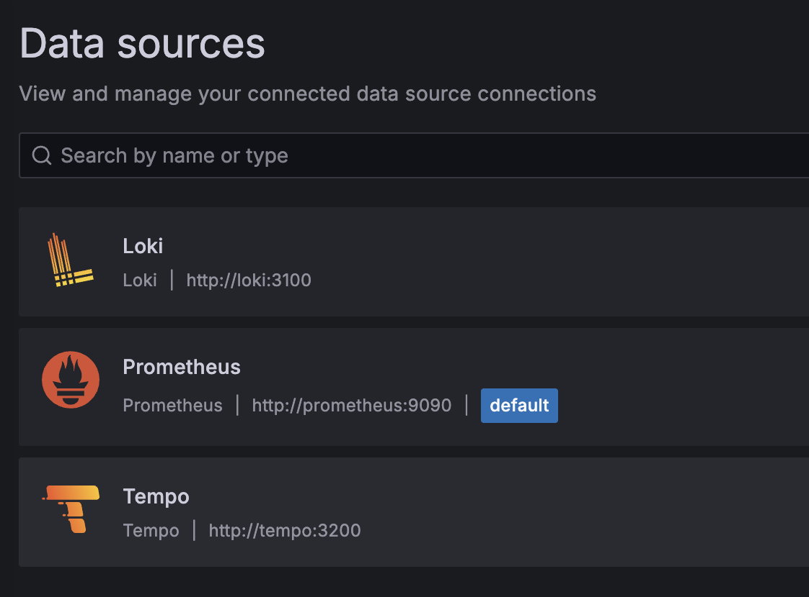
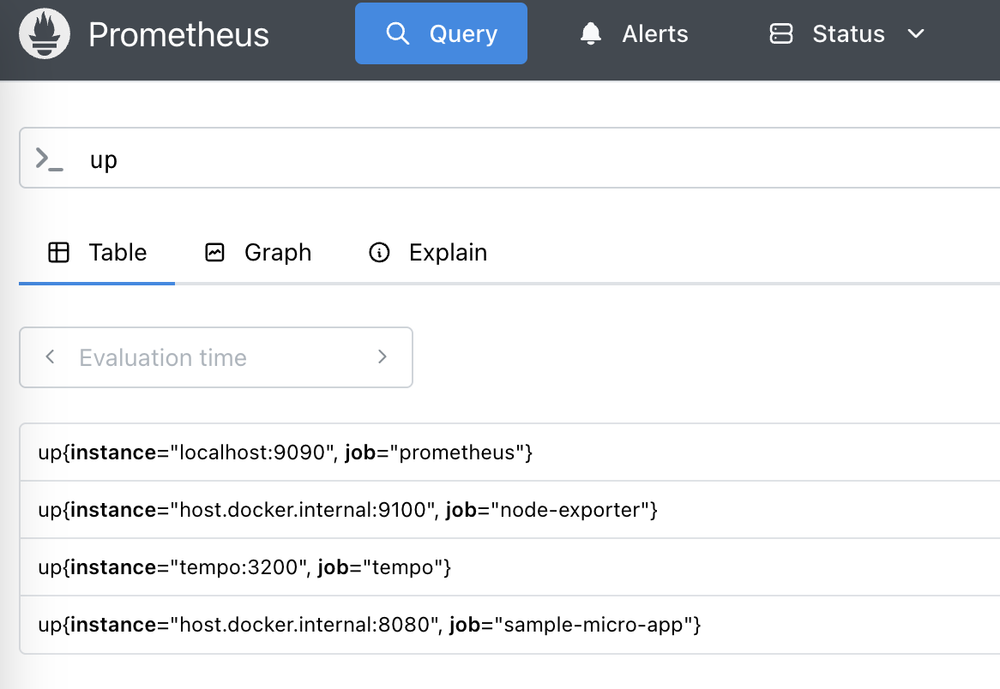
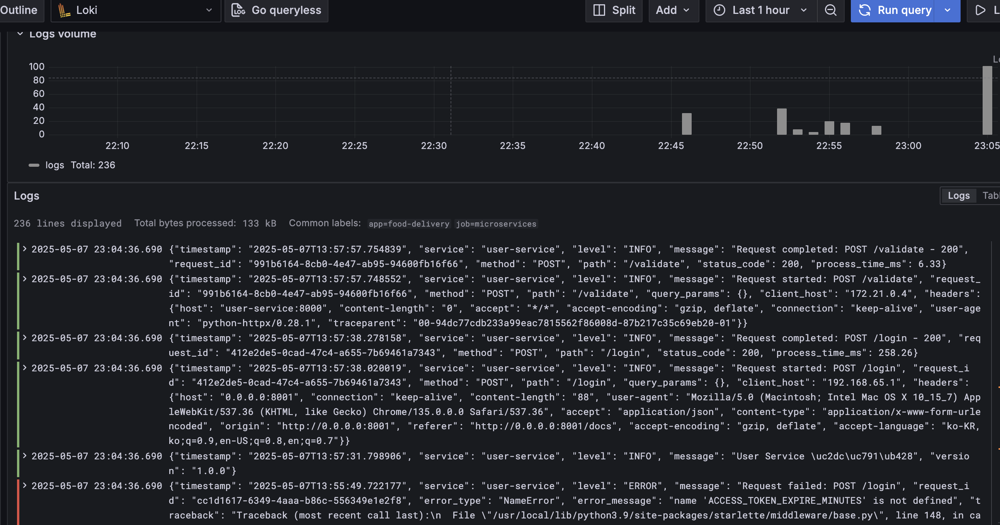
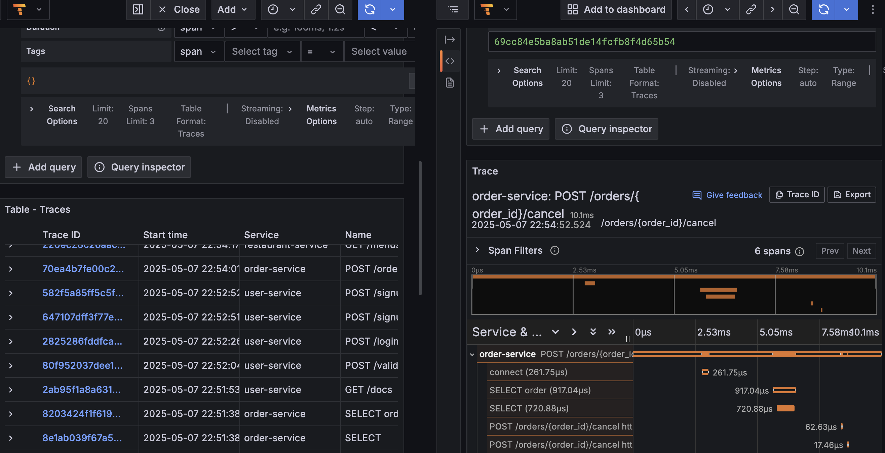

# 모니터링 및 로깅 인프라

이 디렉토리에는 샘플 마이크로 애플리케이션에 대한 모니터링 및 로깅 인프라 설정이 포함되어 있습니다.

## 구성 요소

- **Prometheus**: 메트릭 수집 및 저장
- **Loki**: 로그 수집 및 저장
- **Promtail**: 로그 수집 에이전트
- **Tempo**: 분산 추적 시스템
- **Grafana**: 데이터 시각화

## 시작하기

### 사전 설정

모니터링 인프라를 시작하기 전에 다음 필수 Docker 리소스를 생성해야 합니다:

```bash
# 로그 저장용 볼륨 생성
docker volume create sample-micro-app_microservices_logs

# 마이크로서비스와 모니터링 시스템 간 통신을 위한 네트워크 생성
docker network create monitoring
```

이 리소스들은 docker-compose.yml 파일에서 외부 리소스로 지정되어 있어 미리 생성해야 합니다:
- `sample-micro-app_microservices_logs`: 마이크로서비스의 로그를 저장하고 Promtail이 수집할 수 있도록 하는 공유 볼륨
- `monitoring`: 마이크로서비스와 모니터링 인프라 간의 통신을 위한 공유 네트워크

### 실행 방법

모든 서비스를 실행하려면 다음 명령어를 사용하세요:

```bash
docker-compose up -d
```

마이크로서비스를 시작하기 전에 이 모니터링 인프라를 먼저 시작하는 것이 좋습니다.

## 데이터 소스 설정

Grafana는 자동으로 Prometheus, Loki, Tempo 데이터 소스를 설정합니다.



## 접속 정보

- **Grafana**: http://localhost:3000 (admin / password)
- **Prometheus**: http://localhost:9090
- **Loki**: http://localhost:3100
- **Tempo**: http://localhost:3200

## 모니터링 시스템 상세

### Prometheus (메트릭 수집)

Prometheus는 시계열 데이터베이스로 메트릭을 수집하고 저장합니다. 마이크로서비스에서 노출된 메트릭을 주기적으로 수집하고 저장합니다.



### Loki (로그 수집)

Loki는 로그 집계 시스템으로, 마이크로서비스에서 생성된 로그를 수집하여 중앙에서 관리합니다. Promtail을 에이전트로 사용하여 로그 파일을 읽고 Loki로 전송합니다.



### Tempo (분산 추적)

Tempo는 마이크로서비스 간의 요청 흐름을 추적하는 분산 추적 시스템입니다. OpenTelemetry, Zipkin, Jaeger 등 다양한 프로토콜을 지원합니다.



## 애플리케이션 연동 방법

### 메트릭 수집 (Prometheus)

애플리케이션에서 Prometheus 메트릭을 노출하려면 `/metrics` 엔드포인트를 구현하고 포트 8080에서 실행하세요.

### 로그 수집 (Loki)

애플리케이션 로그를 `/var/log/microservices/*.log` 경로에 저장하면 Promtail이 자동으로 수집합니다.

### 분산 추적 (Tempo)

애플리케이션에서 OpenTelemetry, Zipkin 또는 Jaeger 프로토콜을 사용하여 Tempo에 추적 데이터를 전송할 수 있습니다:

- OpenTelemetry: http://tempo:4318 (HTTP) 또는 tempo:4317 (gRPC)
- Zipkin: http://tempo:9411
- Jaeger: http://tempo:14268 (HTTP)

#### OpenTelemetry 연동 방법

마이크로서비스 애플리케이션에서 OpenTelemetry를 사용하여 Tempo로 트레이스 데이터를 전송하는 방법은 다음과 같습니다:

1. **Python 애플리케이션 설정**:
   - OpenTelemetry 패키지 설치:
     ```bash
     pip install opentelemetry-distro opentelemetry-exporter-otlp
     opentelemetry-bootstrap -a install
     ```
   
   - 애플리케이션 실행 시 OpenTelemetry 자동 계측 사용:
     ```bash
     OTEL_SERVICE_NAME=your-service-name \
     OTEL_EXPORTER_OTLP_ENDPOINT=http://localhost:4317 \
     OTEL_TRACES_EXPORTER=otlp \
     opentelemetry-instrument python app.py
     ```

2. **Docker 컨테이너에서 실행 시 설정**:
   - Dockerfile에 OpenTelemetry 설정 추가:
     ```dockerfile
     # OpenTelemetry 관련 패키지 설치
     RUN pip install opentelemetry-distro opentelemetry-exporter-otlp
     RUN opentelemetry-bootstrap -a install

     # OpenTelemetry 자동계측 실행
     CMD ["opentelemetry-instrument", "--service_name", "your-service-name", "명령어"]
     ```
   
   - docker-compose.yml에 환경 변수 설정:
     ```yaml
     environment:
       - OTEL_SERVICE_NAME=your-service-name
       - OTEL_EXPORTER_OTLP_ENDPOINT=http://localhost:4317
       - OTEL_RESOURCE_ATTRIBUTES=service.name=your-service-name,service.namespace=your-namespace
       - OTEL_TRACES_EXPORTER=otlp
       - OTEL_METRICS_EXPORTER=otlp
     ```

3. **크로스 플랫폼 호환성을 위한 설정**:
   - 이 프로젝트는 Linux 환경에서도 원활히 동작하도록 `localhost`를 사용합니다.
   - 컨테이너에서 호스트의 서비스에 접근할 때는 `localhost`를 사용하여 크로스 플랫폼 호환성을 보장합니다.

4. **트레이스 확인**:
   - Grafana에 접속하여 Explore 메뉴로 이동
   - 데이터 소스로 "Tempo" 선택
   - 서비스 이름, 트레이스 ID 또는 다른 조건으로 검색 가능

5. **트러블슈팅**:
   - 트레이스가 보이지 않는 경우:
     ```bash
     # Tempo 서비스 로그 확인
     docker logs tempo
     
     # 마이크로서비스 로그에서 OpenTelemetry 관련 오류 확인
     docker logs your-service-container | grep -i otel
     ```

## 알림 설정

현재 설정에는 알림이 구성되어 있지 않습니다. 필요한 경우 Prometheus AlertManager를 추가하여 알림을 설정할 수 있습니다. 